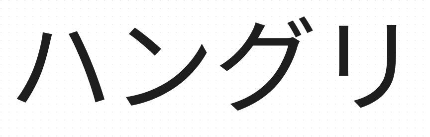

<p align="middle" >
  
</p>

<p align="middle">
    
    
   
</p>

### 🌌 Think Different 

**Story:** Follow the polka dots through the world of Yayoi Kusama's dot obsession art, encompassing her iconic pumpkins, mesmerizing flowers, and more, each piece a vibrant testament to her unique, hypnotic style.
**Interactivity:** Hovering over quotes changes color. The 3d model, quotes, text appear as the story progresses.
**Animations:** Rotating pumpkin, Rotating Mac and Windows Computer, drawing quotes svg, typing animation, fade-in, sliding images, the transition from the thought provoking quote's first sentence to the complete quote using scroll control. 

Technical Showcase:
React & Three & svg & Responsive Design 

## :runner: Installation

1. Clone Repository

   ```bash
   git clone "https://github.com/luke-song/luma-think-different"
   ```

2. Install modules

   ```bash
   npm install
   ```

3. Run App
   ```
   npm run dev
   ```


